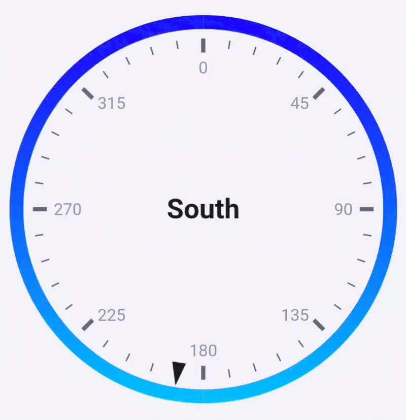

# Tutorial: Visualizing wind directions with a Gauge

The [Gauge](./) widget can be configured to display a compass. This tutorial will walk you through the steps to set up a gauge that dynamically updates based on real-time wind direction information.

<figure><figcaption></figcaption></figure>


This guide assumes you already have an app capability or variable in Homey that provides the wind direction in degrees. An example of a Homey app that exposes this data is the KNMI app (Dutch), or the Netatmo app if you have the Netatmo wind gauge.


In this tutorial, you are expected to link each new Homey card to the one from the previous step, to ensure that each action is executed in the correct order.



### Create a flow triggered by wind direction change

Open your flow editor and start by creating a new flow. Add a trigger card that is triggered by a change of wind direction.



### Convert the degrees to human-readable text

Use the HomeyScript card "Execute code with argument and return Text tag" with the following code to expose a text tag containing a human readable direction for the degrees.

Chose the wind direction from step 1 as its argument.&#x20;

```javascript
// Calculate wind direction

// args[0] is the wind direction in degrees
let deg = args[0];

// Normalize input to 0-360 just in case
deg = ((deg % 360) + 360) % 360;

let direction;

if ((deg > 337.5 && deg <= 360) || (deg >= 0 && deg <= 22.5)) {
    direction = 'North';
} else if (deg > 22.5 && deg <= 67.5) {
    direction = 'Northeast';
} else if (deg > 67.5 && deg <= 112.5) {
    direction = 'East';
} else if (deg > 112.5 && deg <= 157.5) {
    direction = 'Southeast';
} else if (deg > 157.5 && deg <= 202.5) {
    direction = 'South';
} else if (deg > 202.5 && deg <= 247.5) {
    direction = 'Southwest';
} else if (deg > 247.5 && deg <= 292.5) {
    direction = 'West';
} else if (deg > 292.5 && deg <= 337.5) {
    direction = 'Northwest';
} else {
    direction = 'Unknown';
}

return direction; code
```



### Set the range and wind direction using DataVista

Create an action card using the DataVista range action card to define the range.

<figure><figcaption></figcaption></figure>

1. Choose an identifier for this wind direction gauge, such as "Wind gauge". This will be used later as a datasource in the widget to display the price.
2. Set the minimum and maximum values to 0 and 360.&#x20;
3. Set the value to the number token from step 1 that contains the wind direction.&#x20;
4. Set the unit to symbol °, placed after the value.
5. Overwrite the label with the text token from step 2 that contains the human readable wind direction.



### Optionally, set the range visualization using DataVista

Create an action card using the DataVista gauge configuration action card to define the visualization.

<figure><figcaption></figcaption></figure>

1. Choose an identifier for this gauge, such as "Visualization for wind gauge." This identifier will be used later as a config source in the widget to apply the visualization.
2. Set the axes color to, for example, blue at position 0 for a solid color.



### Add the widget to your dashboard

Finally, follow the steps outlined in "[Gauge - Adding the widget to your dashboard](./#adding-the-widget-to-your-dashboard)" to add an **Advanced Gauge** and select the DataVista identifier you created in step `3` as the datasource. Then, select the configsource you created in step `4`. This will link the range, value, and visualization to the gauge.



