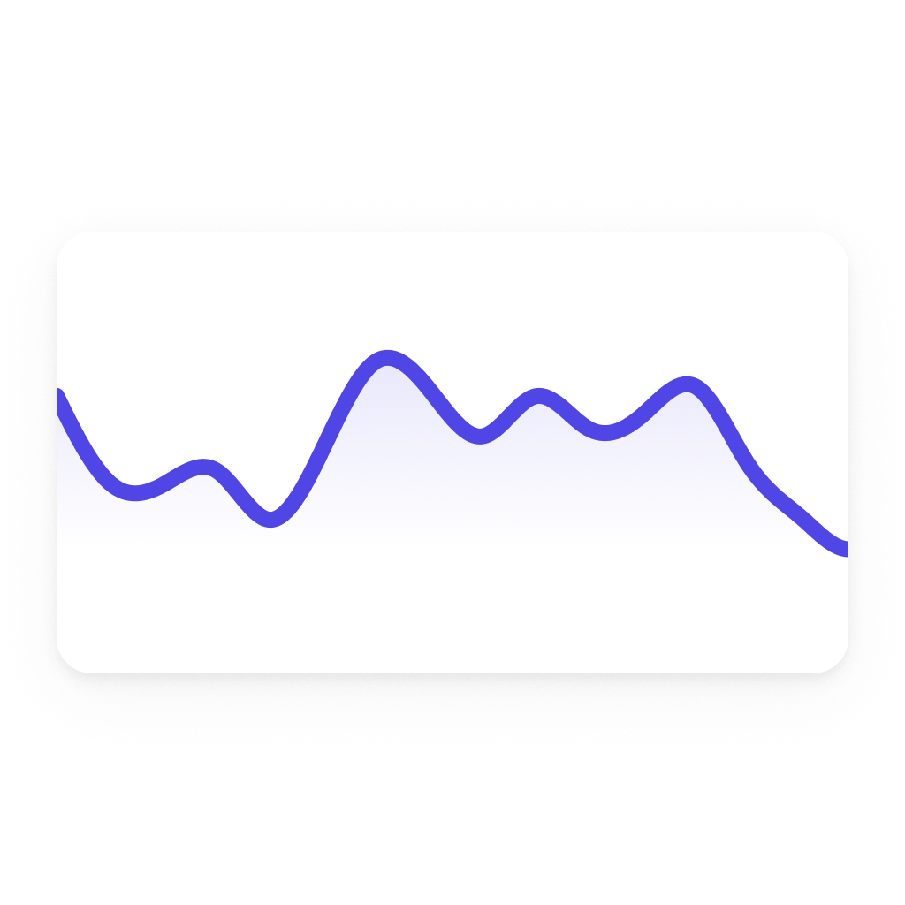

# Line chart

The **Line chart widget** in DataVista enables you to effortlessly compare two Homey insights in a single graph. This unique feature allows you to visualize and analyze the relationship between different data points, such as energy usage and temperature, side by side. With its intuitive design, the widget helps you uncover patterns and correlations, offering deeper insights into your Homey data.

Additionally, you can click on any data point within the chart to view more detailed information in a tooltip, providing a more granular look at the data for further analysis.

<figure><figcaption></figcaption></figure>

The widget currently supports displaying **Homey insights**, allowing you to visualize and compare different data points.

### Adding the widget to your dashboard 

To add the toggle switch widget to your dashboard, follow these simple steps:

1. Open your Homey app and go to the **Dashboards** section.
2. Enter **Edit Mode** and select the **"Add Widget"** button.
3. Select **"Apps"** at the top and look for the app called **"DataVista"**.
4. Look for the **"Line chart"** widget. You can easily identify it by the preview image (as shown below).
5. Once you find it, click on the widget preview to add it to your dashboard.

After adding it, you can customize the widget to display a specific Homey insight.

<figure><picture><source srcset="../.gitbook/assets/preview-dark.png" media="(prefers-color-scheme: dark)"></picture><figcaption>
Line chart widget preview
</figcaption></figure>

## Configuring the widget

The widget has the following configurable settings:

<table><thead><tr><th width="199">Setting</th><th>Description</th></tr></thead><tbody><tr><td><strong>Timeframe</strong></td><td>Determines the period for which data is displayed in the chart. Options include day, week, month, or year.</td></tr><tr><td><strong>Datasource 1</strong></td><td>Choose a Homey insights source to display as the first data series in the chart. This will represent the primary data being visualized.</td></tr><tr><td><strong>Period 1</strong></td><td>Specifies the period (this or previous) to display for datasource 1, relative to the selected timeframe.</td></tr><tr><td><strong>Color 1</strong></td><td>Sets the color for the data series associated with datasource 1, allowing you to distinguish it from datasource 2.</td></tr><tr><td><strong>Datasource 2</strong></td><td>Select a second Homey insights source to display as the second data series in the chart, allowing for comparison with the first datasource.</td></tr><tr><td><strong>Period 2</strong></td><td>Specifies the period (this or previous) to display for datasource 1, relative to the selected timeframe.</td></tr><tr><td><strong>Color 2</strong></td><td>Sets the color for the data series associated with datasource 2, allowing you to distinguish it from datasource 1.</td></tr><tr><td><strong>Show Icon</strong></td><td>Enable to show the capability or device icon (if available), with priority given to the capability icon.</td></tr><tr><td><strong>Show refresh countdown</strong></td><td>Option to show or hide the progress bar that indicates the time remaining until the chart refreshes with the latest data.</td></tr></tbody></table>

## FAQ

### How can I show only the primary data source in the chart?

To display only the primary data source, simply leave datasource 2 unconfigured. Additionally, ensure that the period for datasource 2 (Period 2) is set to the same value as the period for datasource 1 (Period 1). This will ensure consistency in the chart and allow the primary data source to be visualized without the secondary data series.

### How can I compare the same data source for this period vs the previous?

To compare the same data source for the current period vs the previous one, leave datasource 2 empty. Then, set period 2 to a different period than period 1, such as selecting "this" for period 1 and "previous" for period 2. This will allow you to visualize the comparison between the two periods using the same data source.

### Does the chart auto-refresh?

Yes, the chart refreshes automatically, following the update pattern of the respective Homey insight.

### Why can’t I select the last hour as a timeframe?

Homey does not yet expose insights specific to both the current and previous hour, which is why this option is not available.

### How can I see more details about a specific data point in the chart?

To view more detailed information about a specific data point, simply click on it within the chart. A tooltip will appear with additional context for that data point.

### How do I close the tooltip?

To close the tooltip, click on either the horizontal (x-axis) or vertical (y-axis) axis, and the tooltip will disappear.
