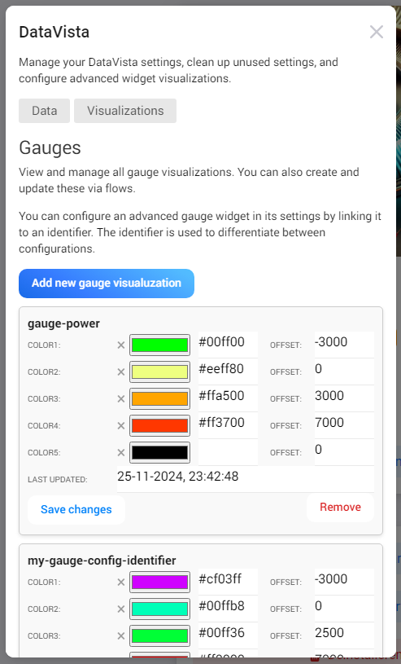

# Toggle switch

The **Toggle Switch** widget offers a sleek and minimalistic way to display boolean values, such as whether a light is on or off, a door is open or closed, a sensor is active or inactive, or any other binary condition. Its straightforward design ensures clear visibility, making it easy to monitor the status of your devices at a glance.

For advanced users, the widget can accept a boolean value set by a **DataVista action card**.

<figure><figcaption></figcaption></figure>

### Adding the widget to your dashboard 

To add the toggle switch widget to your dashboard, follow these simple steps:

1. Open your Homey app and go to the **Dashboards** section.
2. Enter **Edit Mode** and select the **"Add Widget"** button.
3. Select **"Apps"** at the top and look for the app called **"DataVista"**.
4. Look for the **"Toggle switch"** widget. You can easily identify it by the preview image (as shown below).
5. Once you find it, click on the widget preview to add it to your dashboard.

After adding it, you can customize the widget to display the state of specific devices or binary conditions based on your preferences.

<figure><picture><source srcset="../.gitbook/assets/preview-dark (1).png" media="(prefers-color-scheme: dark)"></picture><figcaption>
Toggle switch widget preview
</figcaption></figure>

## Configuring the widget

The widget has the following configurable settings:

<table><thead><tr><th width="199">Setting</th><th>Description</th></tr></thead><tbody><tr><td><strong>Datasource</strong></td><td>Select either a <em>DataVista boolean value*, device capability</em> or <em>Homey variable</em> to use as the switch value.</td></tr><tr><td><strong>Refresh Interval</strong></td><td>When a device capability or <em>Homey variable</em> is selected, this determines how often the widget updates to reflect new values.</td></tr><tr><td><strong>Show name</strong></td><td>If checked the name of the datasource will be displayed in the widget.</td></tr><tr><td><strong>Color if true</strong></td><td>Specifies the color to display when the widget's value is <code>true</code>.</td></tr><tr><td><strong>Color if false</strong></td><td>Specifies the color to display when the widget's value is <code>false</code>.</td></tr><tr><td><strong>FA icon code if true</strong></td><td>Specifies the FontAwesome Unicode code for the icon to display when the widget's value is <code>true</code>. It must be a free, solid icon from FontAwesome version 6. You can browse available icons <a href="https://fontawesome.com/v6/search?o=r&#x26;m=free&#x26;s=solid">here</a>.</td></tr><tr><td><strong>FA icon code if false</strong></td><td>Specifies the FontAwesome Unicode code for the icon to display when the widget's value is <code>false</code>. It must be a free, solid icon from FontAwesome version 6. You can browse available icons <a href="https://fontawesome.com/v6/search?o=r&#x26;m=free&#x26;s=solid">here</a>.</td></tr><tr><td><strong>Show Icon</strong></td><td>Enable to show the capability or device icon (if available), with priority given to the capability icon.</td></tr><tr><td><strong>Overwrite Name</strong></td><td>If set, this name will be displayed instead of the datasource name.</td></tr></tbody></table>


To use a **DataVista boolean value**, you must first create a flow that sets this value using a **DataVista action card**. The flow needs to be run **once initially** in order to make the value visible and selectable in the widget settings. After running the flow, the value will appear at the top of the list in the **Datasource** setting.



## FAQ

### Why is the switch animating between on and off?

If the switch is animating between on and off, it indicates that the datasource could not be found (or is no longer available). This typically happens when the selected datasource is removed. To resolve this issue, try reconfiguring the datasource setting and ensure the correct value is selected.

### Why is my toggle icon showing as a square box?

This usually happens when an incorrect unicode value is used. Ensure that the configured unicode value matches a valid free [FontAwesome v6 icon](https://fontawesome.com/v6/search?o=r\&m=free\&s=solid) (solid style).

